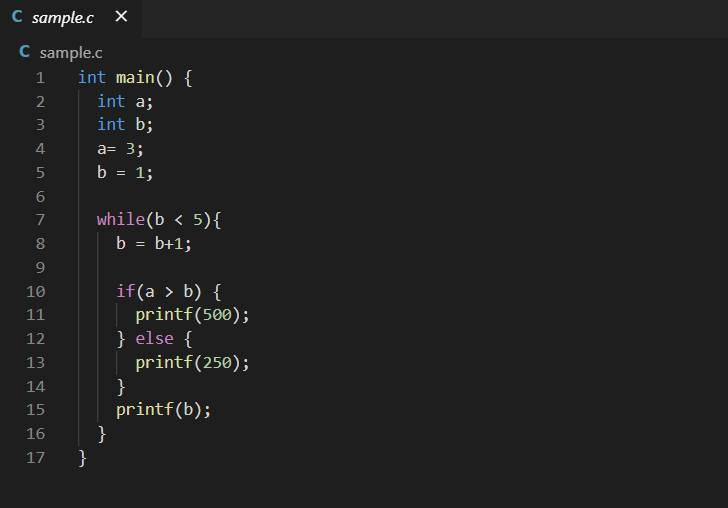

# Mini-C Interpreter

Interprets C, written in OCaml

## Running C programs

* Clone the repo to your local machine
* Write a C script containing supported functionality


* Run the following command inside the project's directory
```
dune exec bin/interface.bc -- <path_to_C_file>
```
* Observe your output


## Getting Started

### Dependencies

Mini-C Interpreter is compatible with Linux systems. The following command will install all the packages required to run the interpreter. 
```
sudo apt-get install ocaml ocaml-native-compilers camlp4 opam
```

### The following C keywords are supported: 

* For
* From
* To
* While
* Int
* Bool
* \-
* ;
* ()
* {}
* printf
* ^
* \+ 
* || 
* &&
* !=
* !
* \*
* main
* <=
* < 
* if
* \>=
* ==
* else
* /
* true
* false 
* = 
